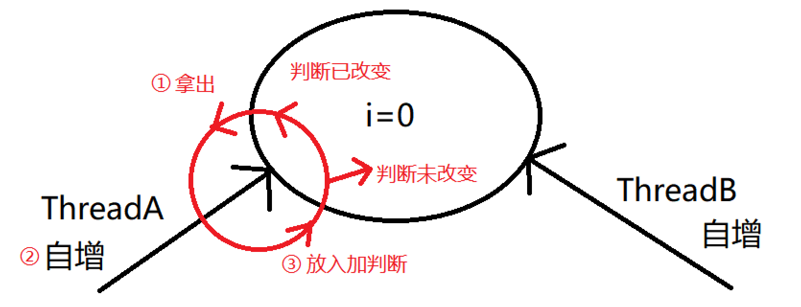

# JUC高并发编程（基础）

## JUC概述

### JUC简介

在 Java 中，线程部分是一个重点，本篇文章说的JUC也是关于线程的。JUC就是 `java.util.concurrent`工具包的简称。这是一个处理线程的工具包，JDK 1.5 开始出现的。


### 进程与线程

**进程（Process）** 

进程是计算机中的程序关于某数据集合上的一次运行活动，是系统进行资源分配和调度的基本单位，是操作系统结构的基础。 在当代面向线程设计的计算机结构中，进程是线程的容器。程序是指令、数据及其组织形式的描述，进程是程序的实体。是计算机中的程序关于某数据集合上的一次运行活动，是系统进行资源分配和调度的基本单位，是操作系统结构的基础。程序是指令、数据及其组织形式的描述，进程是程序的实体。

**线程（thread）** 

线程是操作系统能够进行运算调度的最小单位。它被包含在进程之中，是进程中的实际运作单位。一条线程指的是进程中一个单一顺序的控制流，一个进程中可以并发多个线程，每条线程并行执行不同的任务。

**总结**

- 进程：指在系统中正在运行的一个应用程序；程序一旦运行就是进程；进程——资源分配的最小单位。
- 线程：系统分配处理器时间资源的基本单元，或者说进程之内独立执行的一个单元执行流。线程——程序执行的最小单位。

### 线程的状态

#### 线程状态枚举类

该枚举中包含了线程的状态；

```java
public enum State {
    /**
     * Thread state for a thread which has not yet started.
     */
    NEW, // 新建

    /**
     * Thread state for a runnable thread.  A thread in the runnable
     * state is executing in the Java virtual machine but it may
     * be waiting for other resources from the operating system
     * such as processor.
     */
    RUNNABLE, // 准备就绪

    /**
     * Thread state for a thread blocked waiting for a monitor lock.
     * A thread in the blocked state is waiting for a monitor lock
     * to enter a synchronized block/method or
     * reenter a synchronized block/method after calling
     * {@link Object#wait() Object.wait}.
     */
    BLOCKED, // 阻塞

    /**
     * 不见不散
     * Thread state for a waiting thread.
     * A thread is in the waiting state due to calling one of the
     * following methods:
     * <ul>
     *   <li>{@link Object#wait() Object.wait} with no timeout</li>
     *   <li>{@link #join() Thread.join} with no timeout</li>
     *   <li>{@link LockSupport#park() LockSupport.park}</li>
     * </ul>
     *
     * <p>A thread in the waiting state is waiting for another thread to
     * perform a particular action.
     *
     * For example, a thread that has called <tt>Object.wait()</tt>
     * on an object is waiting for another thread to call
     * <tt>Object.notify()</tt> or <tt>Object.notifyAll()</tt> on
     * that object. A thread that has called <tt>Thread.join()</tt>
     * is waiting for a specified thread to terminate.
     */
    WAITING, // 等待

    /**
     * 过时不候
     * Thread state for a waiting thread with a specified waiting time.
     * A thread is in the timed waiting state due to calling one of
     * the following methods with a specified positive waiting time:
     * <ul>
     *   <li>{@link #sleep Thread.sleep}</li>
     *   <li>{@link Object#wait(long) Object.wait} with timeout</li>
     *   <li>{@link #join(long) Thread.join} with timeout</li>
     *   <li>{@link LockSupport#parkNanos LockSupport.parkNanos}</li>
     *   <li>{@link LockSupport#parkUntil LockSupport.parkUntil}</li>
     * </ul>
     */
    TIMED_WAITING, // 定时等待

    /**
     * Thread state for a terminated thread.
     * The thread has completed execution.
     */
    TERMINATED; // 终止
}
```

#### wait/sleep的区别

（1）`sleep()` 是 Thread 类的静态方法，`wait()` 是 Object 类的方法，任何对象实例都能调用。

（2）`sleep()` 不会释放锁，它也不需要占用锁。`wait()` 会释放锁，但调用它的前提是当前线程占有锁(即代码要在 `synchronized` 中)。

（3）它们都可以被 `interrupted` 方法中断。

### 并发与并行

#### 串行

串行表示所有任务都一一按先后顺序进行。串行意味着必须先装完一车柴才能运送这车柴，只有运送到了，才能卸下这车柴，并且只有完成了这整个三个步骤，才能进行下一个步骤。

**串行是一次只能取得一个任务，并执行这个任务。**

#### 并行

并行意味着可以同时取得多个任务，并同时去执行所取得的这些任务。并行模式相当于将长长的一条队列，划分成了多条短队列，所以并行缩短了任务队列的长度。并行的效率从代码层次上强依赖于多进程/多线程代码，从硬件角度上则依赖于多核CPU。

#### 并发

**并发（concurrent）指的是多个程序可以同时运行的现象，更细化的是多进程可以同时运行或者多指令可以同时运行。**但这不是重点，在描述并发的时候也不会去扣这种字眼是否精确，==并发的重点在于它是一种现象，并发描述的是多进程同时运行的现象==。但实际上，对于单核心CPU来说，同一时刻只能运行一个线程。所以，这里的"同时运行"表示的不是真的同一时刻有多个线程运行的现象，这是并行的概念，而是提供一种功能让用户看来多个程序同时运行起来了，但实际上这些程序中的进程不是一直霸占CPU的，而是执行一会停一会。

**要解决大并发问题，通常是将大任务分解成多个小任务**，由于操作系统对进程的调度是随机的，所以切分成多个小任务后，可能会从任一小任务处执行。这可能会出现一些现象：

- 可能出现一个小任务执行了多次，还没开始下个任务的情况。这时一般会采用队列或类似的数据结构来存放各个小任务的成果。
- 可能出现还没准备好第一步就执行第二步的可能。这时，一般采用多路复用或异步的方式，比如只有准备好产生了事件通知才执行某个任务。
- 可以多进程/多线程的方式并行执行这些小任务。也可以单进程/单线程执行这些小任务，这时很可能要配合多路复用才能达到较高的效率。

#### 小结（重点）

**并发：**同一时刻多个线程在访问同一个资源，多个线程对一个点，比如：春运抢票，电商秒杀......

**并行：**多项工作一起执行，之后再汇总，比如：泡方便面，一边电水壶烧水，一边撕调料倒入桶中。

### 管程

管程(monitor)是保证了同一时刻只有一个进程在管程内活动,即管程内定义的操作在同一时刻只被一个进程调用(由编译器实现).但是这样并不能保证进程以设计的顺序执行。

JVM中同步是基于进入和退出管程(monitor)对象实现的，每个对象都会有一个管程(monitor)对象，管程(monitor)会随着java对象一同创建和销毁。

执行线程首先要持有管程对象，然后才能执行方法，当方法完成之后会释放管程，方法在执行时候会持有管程，其他线程无法再获取同一个管程。

用户线程和守护线程

### 用户线程和守护线程

用户线程：平时用到的普通线程，自定义线程。

守护线程：运行在后台，是一种特殊的线程，比如垃圾回收。

当主线程结束后，用户线程还在运行，JVM存活，[示例代码](./juc-base-demo/src/main/java/top/sharehome/demo01/Demo01_1.java)如下：

```java
/**
 * 用户线程和主线程
 * 如果用户线程还在进行，JVM就一直存活不终止
 *
 * @author AntonyCheng
 */
public class Demo01_1 {

    public static void main(String[] args) {
        // 创建用户线程，即普通线程
        Thread thread = new Thread(() -> {
            // 使用 Thread.isDaemon() 判断线程是否是守护线程，不是守护线程就是用户线程
            System.out.println("这是" + (Thread.currentThread().isDaemon() ? "守护线程" : "用户线程") + ":" + Thread.currentThread().getName());
            // 让用户线程死循环
            for (; ; ) {

            }
        }, "user");
        // 启动用户线程
        thread.start();
        // 主线程打印
        System.out.println("这是主线程:" + Thread.currentThread().getName());
    }

}
```

运行结果如下：


如果除主线程外没有用户线程，且都是守护线程，即使守护线程还在允许，JVM依旧结束，[示例代码](./juc-base-demo/src/main/java/top/sharehome/demo01/Demo01_2.java)如下：

```java
/**
 * 守护线程和主线程
 * 如果只有守护线程还在进行，一旦主线程终止，JVM就会终止
 *
 * @author AntonyCheng
 */
public class Demo01_2 {

    public static void main(String[] args) {
        // 创建守护线程，即普通线程
        Thread thread = new Thread(() -> {
            // 使用 Thread.isDaemon() 判断线程是否是守护线程，不是守护线程就是用户线程
            System.out.println("这是" + (Thread.currentThread().isDaemon() ? "守护线程" : "用户线程") + ":" + Thread.currentThread().getName());
            // 让守护线程死循环
            for (; ; ) {

            }
        }, "daemon");
        // 将thread线程转换为守护线程
        thread.setDaemon(true);
        // 启动守护线程
        thread.start();
        // 主线程打印
        System.out.println("这是主线程:" + Thread.currentThread().getName());
    }

}
```

运行结果如下：


## Lock接口

### Synchronized

#### Synchronized关键字回顾

synchronized是Java中的关键字，是一种同步锁。而实现同步的基础：Java中的每一个对象都可以作为锁，具体表现为以下3种形式：

- 对于同步代码块，锁是 synchonized 括号里的配置对象。
- 对于同步普通方法，锁是当前类的实例化对象。
- 对于同步静态方法，锁是当前类的 Class 对象。

它修饰的对象有几种，[示例代码](./juc-base-demo/src/main/java/top/sharehome/demo02/Demo02_1.java)如下：

（1）修饰一个代码块，被修饰的代码块称为同步语句块，其作用的范围是大括号{}括起来的代码，作用的对象是调用这个代码块的对象。

```java
/**
 * 修饰代码块
 */
public void syncCodeBlock() {
    synchronized (this) {
        System.out.println("同步代码块...");
    }
}
```

（2）修饰一个方法，被修饰的方法称为同步方法，其作用的范围是整个方法，作用的对象是调用这个方法的对象。注意：虽然可以使用synchronized来定义方法，但synchronized并不属于方法定义的一部分，因此，synchronized关键字不能被继承。如果在父类中的某个方法使用了synchronized关键字，而在子类中覆盖了这个方法，在子类中的这个方法默认情况下并不是同步的，而必须显式地在子类的这个方法中加上synchronized关键字才可以。当然，还可以在子类方法中调用父类中相应的方法，这样虽然子类中的方法不是同步的，但子类调用了父类的同步方法，因此，子类的方法也就相当于同步了。

```java
/**
 * 修饰方法
 */
public synchronized void syncMethod() {
    System.out.println("同步方法...");
}
```

（3）修饰一个静态的方法，其作用的范围是整个静态方法，作用的对象是这个类的所有对象。

```java
/**
 * 修饰静态方法
 */
public static synchronized void syncStaticMethod() {
    System.out.println("同步静态方法...");
}
```

==**注意：**==**当执行代码时，不是同一把锁，就不需要阻塞等待**。举个例子，假设上述示例代码中的 `syncMethod()` 方法和 `syncStaticMethod()` 方法在同一个 Demo 类中，那么前者获取的锁是 Demo 类实例化之后得到的一个 **Demo 对象**，后者获取的锁是 Demo 类自身的 **Class 对象**，当两者同时被不同线程调用时，不会出现阻塞状态，底层原因就是竞争的 CPU 资源不是相同的。

#### Synchronized编程案例

**初级的多线程编程步骤如下**：

1. 确定共享资源，并且创建资源类，在该类中创建属性和操作方法。
2. 创建多线程，调用上述资源类的操作方法去操作共享资源。

案例：出售门票，有3个售票员，一共有30张票，[示例代码](./juc-base-demo/src/main/java/top/sharehome/demo02/Demo02_2.java)如下：

```java
/**
 * Synchronized编程案例
 * 出售门票，有3个售票员，一共有30张票
 *
 * @author AntonyCheng
 */

public class Demo02_2 {

    public static void main(String[] args) {
        Ticket ticket = new Ticket();
        // 定义3个售票员（创建三个线程）
        Thread sale01 = new Thread(() -> {
            while (true) {
                ticket.sale();
            }
        }, "sale01");
        Thread sale02 = new Thread(() -> {
            while (true) {
                ticket.sale();
            }
        }, "sale02");
        Thread sale03 = new Thread(() -> {
            while (true) {
                ticket.sale();
            }
        }, "sale03");
        // 让3个售票员开始售票（启动三个线程）
        sale01.start();
        sale02.start();
        sale03.start();
    }

}

/**
 * 编写门票资源类
 */
class Ticket {

    /**
     * 定义门票数量
     */
    private static int ticketNumber = 30;

    /**
     * 定义卖出数量
     */
    private static int saleNumber = 0;

    /**
     * 定义售票方法，这里使用synchronized修饰代码块
     */
    public void sale() {
        synchronized (this) {
            if (ticketNumber > 0) {
                System.out.println(Thread.currentThread().getName() + "卖出第" + (++saleNumber) + "张票，还剩" + (--ticketNumber) + "张票");
            }
        }
    }

}
```

运行结果如下：


如果一个代码块被synchronized修饰了，当一个线程获取了对应的锁，并执行该代码块时，其他线程便只能一直等待，等待获取锁的线程释放锁，而这里获取锁的线程释放锁只会有两种情况：

1. 获取锁的线程执行完了该代码块，然后线程释放对锁的占有。
2. 线程执行发生异常，此时JVM会让线程自动释放锁。

那么如果这个获取锁的线程由于要等待IO或者其他原因（比如调用sleep方法）被阻塞了，但是又没有释放锁，其他线程便只能干巴巴地等待，试想一下，这多么影响程序执行效率。

因此就需要有一种机制可以不让等待的线程一直无期限地等待下去（比如只等待一定的时间或者能够响应中断），通过 Lock 接口就可以办到。

### 什么是Lock接口

Lock锁接口实现提供了比使用同步方法和语句可以获得的更广泛的锁操作。它们允许更灵活的结构，可能具有非常不同的属性，并且可能支持多个关联的条件对象。Lock提供了比synchronized更多的功能。

**Lock与的Synchronized区别：**

- Lock不是Java语言内置的，synchronized是Java语言的关键字，因此是内置特性。Lock是一个类，通过这个类可以实现同步访问。
- Lock和synchronized有一点非常大的不同，采用synchronized不需要用户去手动释放锁，当synchronized方法或者synchronized代码块执行完之后，系统会自动让线程释放对锁的占用；而Lock则必须要用户去手动释放锁，如果没有主动释放锁，就有可能导致出现死锁现象。

#### Lock接口

```java
public interface Lock {
    
    /**
     * 获取锁，拿到锁就执行之后的代码，没拿到锁该线程就阻塞等待
     */
    void lock();

    /**
     * 获取锁，拿到锁就执行之后的代码，没拿到锁该线程就阻塞等待，但是等待的过程中被中断，就抛出异常
     */
    void lockInterruptibly() throws InterruptedException;

    /**
     * 尝试获取锁，拿到锁就返回true，没拿到锁就返回false
     */
    boolean tryLock();

    /**
     * 尝试在规定时间内获取锁，拿到锁就返回true，没拿到锁就返回false，如果等待锁的过程中被中断就抛出异常
     */
    boolean tryLock(long time, TimeUnit unit) throws InterruptedException;

    /**
     * 解锁
     */
    void unlock();

    /**
     * 返回Condition实例，该实例和锁相互绑定，可使用Condition实例进行await()等待和signal()唤醒操作
     */
    Condition newCondition();
}
```

该接口有[三个常用的实现类](./juc-base-demo/src/main/java/top/sharehome/demo02/Demo02_3.java)：`ReentrantLock` （可重入锁）、`ReentrantReadWriteLock.ReadLock` （读锁）、`ReentrantReadWriteLock.WriteLock` （写锁）。接下来以 ReentrantLock 类为例，[示例代码](./juc-base-demo/src/main/java/top/sharehome/demo02/Demo02_4.java)如下：

```java
import java.util.concurrent.locks.Condition;
import java.util.concurrent.locks.ReentrantLock;

/**
 * ReentrantLock 可重入锁示例代码
 *
 * @author AntonyCheng
 */

public class Demo02_4 {

    /**
     * 定义可重入锁
     */
    private static final ReentrantLock REENTRANT_LOCK = new ReentrantLock();

    /**
     * lock() 方法标准用法
     * 采用lock()，必须主动去释放锁，并且在发生异常时，不会自动释放锁。
     * 因此一般来说，使用Lock必须在try{}catch{}块中进行，并且将释放锁的操作放在finally块中进行，
     * 以保证锁一定被被释放，防止死锁的发生。
     */
    public static void lockSample() {
        REENTRANT_LOCK.lock();
        try {
            System.out.println("现在执行lock()拿到锁之后的代码，没有执行finally中的代码");
        } finally {
            System.out.println("现在执行finally中的代码，释放锁");
            REENTRANT_LOCK.unlock();
        }
    }

    /**
     * tryLock() 标准用法
     */
    public static void tryLockSample() {
        if (REENTRANT_LOCK.tryLock()) {
            try {
                System.out.println("现在执行tryLock()拿到锁之后的代码");
            } finally {
                REENTRANT_LOCK.unlock();
            }
        } else {
            System.out.println("现在执行tryLock()没拿到锁之后的代码");
        }
    }

    /**
     * newCondition() 用法
     * 关键字synchronized与wait()/notify()这两个方法一起使用可以实现等待/通知模式， Lock锁的newContition()方法返回Condition对象，Condition类中await()和signal()也可以实现等待/通知模式。
     * 注意：在调用Condition的await()/signal()方法前，也需要线程持有相关的Lock锁，调用await()后线程会释放这个锁，在singal()调用后会从当前Condition对象的等待队列中，唤醒 一个线程，唤醒的线程尝试获得锁， 一旦获得锁成功就继续执行。
     */
    public static void newConditionSample() {
        Condition condition = REENTRANT_LOCK.newCondition();
        new Thread(() -> {
            REENTRANT_LOCK.lock();
            try {
                System.out.println(Thread.currentThread().getName() + "线程开始等待...");
                condition.await();
                System.out.println(Thread.currentThread().getName() + "线程结束等待...");
            } catch (InterruptedException e) {
                throw new RuntimeException(e);
            } finally {
                REENTRANT_LOCK.unlock();
            }
        }, "await").start();
        try {
            // 主线程休眠两秒
            System.out.println(Thread.currentThread().getName() + "线程休眠两秒...");
            Thread.sleep(2000);
        } catch (InterruptedException e) {
            throw new RuntimeException(e);
        }
        // 让主线程获得锁
        REENTRANT_LOCK.lock();
        try {
            System.out.println(Thread.currentThread().getName() + "线程休眠完成，唤醒等待中的线程...");
            condition.signalAll();
        } finally {
            REENTRANT_LOCK.unlock();
        }
    }

    /**
     * 方法入口
     */
    public static void main(String[] args) throws InterruptedException {
        // 演示lock()方法
        lockSample();
        // 演示tryLock()方法
        new Thread(Demo02_4::tryLockSample).start();
        tryLockSample();
        // 演示newCondition()方法
        newConditionSample();
    }

}
```

运行结果如下：


对于`ReentrantReadWriteLock.ReadLock` （读锁）和`ReentrantReadWriteLock.WriteLock` （写锁）还有以下注意事项：

- 如果有一个线程已经占用了读锁，则此时其他线程如果要申请写锁，则申请写锁的线程会一直等待释放读锁。
- 如果有一个线程已经占用了写锁，则此时其他线程如果申请写锁或者读锁，则申请的线程会一直等待释放写锁。

#### Lock接口编程案例

使用Lock接口实现售票案例，即出售门票，有3个售票员，一共有30张票，[示例代码](./juc-base-demo/src/main/java/top/sharehome/demo02/Demo02_5.java)如下：

```java
import java.util.concurrent.locks.ReentrantLock;

/**
 * 基于Lock接口实现售票案例
 * 3个售票员，一共有30张票
 *
 * @author AntonyCheng
 */
public class Demo02_5 {

    public static void main(String[] args) {
        LockTicket ticket = new LockTicket();
        // 定义3个售票员（创建三个线程）
        Thread sale01 = new Thread(() -> {
            while (true) {
                ticket.sale();
            }
        }, "sale01");
        Thread sale02 = new Thread(() -> {
            while (true) {
                ticket.sale();
            }
        }, "sale02");
        Thread sale03 = new Thread(() -> {
            while (true) {
                ticket.sale();
            }
        }, "sale03");
        // 让3个售票员开始售票（启动三个线程）
        sale01.start();
        sale02.start();
        sale03.start();
    }

}

/**
 * 编写门票资源类
 */
class LockTicket {

    /**
     * 定义可重入锁
     */
    private static final ReentrantLock LOCK = new ReentrantLock();

    /**
     * 定义门票数量
     */
    private static int ticketNumber = 30;

    /**
     * 定义卖出数量
     */
    private static int saleNumber = 0;

    /**
     * 定义售票方法，这里使用synchronized修饰代码块
     */
    public void sale() {
        LOCK.lock();
        try{
            if (ticketNumber > 0) {
                System.out.println(Thread.currentThread().getName() + "卖出第" + (++saleNumber) + "张票，还剩" + (--ticketNumber) + "张票");
            }
        }finally {
            LOCK.unlock();
        }
    }

}
```

运行结果如下：


#### 小结（重点）

1. Lock是一个接口，而synchronized是Java中的关键字，synchronized是内置的语言实现；
2. synchronized在发生异常时，会自动释放线程占有的锁，因此不会导致死锁现象发生；而Lock在发生异常时，如果没有主动通过unLock()去释放锁，则很可能造成死锁现象，因此使用Lock时需要在finally块中释放锁；
3. Lock可以让等待锁的线程响应中断，而synchronized却不行，使用synchronized时，等待的线程会一直等待下去，不能够响应中断；
4. 通过Lock可以知道有没有成功获取锁，而synchronized却无法办到。
5. Lock可以提高多个线程进行读操作的效率。

## 线程通信

**中级的多线程编程步骤如下**：

1. 确定共享资源，并且创建资源类，在该类中创建属性和操作方法。
2. 在资源类的操作方法中需要做三件事：判断、干活和通知。**（这里就涉及到线程通信）**
3. 创建多线程，调用上述资源类的操作方法去操作共享资源。

### 初级实现（初识）

线程间通信的模型有两种：共享内存和消息传递，以下方式都是基本这两种模型来实现的。我们来基本一道面试常见的题目来分析，即**[两个线程，当前数值初始值为0，一个线程对当前数值加1，另一个线程对当前数值减1，要求用线程间通信实现0，1交替](./juc-base-demo/src/main/java/top/sharehome/demo03/Demo03_1.java)**：

通过synchronized实现：

```java
/**
 * 通过synchronized关键字实现线程通信类
 */
class Demo03_1BySynchronized {

    /**
     * 定义当前数值
     */
    private static int initNum = 0;

    /**
     * 增加1
     */
    private synchronized void increase() {
        try {
            // 如果initNum想增加为1，那么此时就必须为0
            if (initNum != 0) {
                wait();
            }
            System.out.println(Thread.currentThread().getName()+"：当前数字增加1，从" + (initNum++) + "变为" + initNum);
            notifyAll();
        } catch (InterruptedException e) {
            throw new RuntimeException(e);
        }
    }

    /**
     * 减少1
     */
    private synchronized void decrease() {
        try {
            // 如果initNum想减少为0，那么此时就必须为1
            if (initNum != 1) {
                wait();
            }
            System.out.println(Thread.currentThread().getName()+"：当前数字减少1，从" + (initNum--) + "变为" + initNum);
            notifyAll();
        } catch (InterruptedException e) {
            throw new RuntimeException(e);
        }
    }

    /**
     * 对外测试方法
     */
    public void test() {
        new Thread(() -> {
            for (int i = 0; i < 5; i++) {
                increase();
            }
        },"bySynchronizedIncrease").start();
        new Thread(() -> {
            for (int i = 0; i < 5; i++) {
                decrease();
            }
        },"bySynchronizedDecrease").start();
    }

}
```

通过Lock接口实现：

```java
/**
 * 通过Lock接口实现线程通信类
 */
class Demo03_1ByLock {

    /**
     * 定义当前数值
     */
    private static int initNum = 0;

    /**
     * 定义Lock锁
     */
    private static final ReentrantLock REENTRANT_LOCK = new ReentrantLock();

    /**
     * 定义等待/通知类
     */
    private static final Condition CONDITION = REENTRANT_LOCK.newCondition();

    /**
     * 增加1
     */
    private void increase() {
        REENTRANT_LOCK.lock();
        try {
            // 如果initNum想增加为1，那么此时就必须为0
            if (initNum != 0) {
                CONDITION.await();
            }
            System.out.println(Thread.currentThread().getName()+"：当前数字增加1，从" + (initNum++) + "变为" + initNum);
            CONDITION.signalAll();
        } catch (InterruptedException e) {
            throw new RuntimeException(e);
        } finally {
            REENTRANT_LOCK.unlock();
        }
    }

    /**
     * 减少1
     */
    private void decrease() {
        REENTRANT_LOCK.lock();
        try {
            // 如果initNum想增加为1，那么此时就必须为0
            if (initNum != 1) {
                CONDITION.await();
            }
            System.out.println(Thread.currentThread().getName()+"：当前数字减少1，从" + (initNum--) + "变为" + initNum);
            CONDITION.signalAll();
        } catch (InterruptedException e) {
            throw new RuntimeException(e);
        } finally {
            REENTRANT_LOCK.unlock();
        }
    }

    /**
     * 对外测试方法
     */
    public void test() {
        new Thread(() -> {
            for (int i = 0; i < 5; i++) {
                increase();
            }
        },"byLockIncrease").start();
        new Thread(() -> {
            for (int i = 0; i < 5; i++) {
                decrease();
            }
        },"byLockDecrease").start();
    }

}
```

运行结果如下：


### 中级实现（规正）

其实在上述**初级实现**中对于 `wait()` 和 `await()` 的用法是有问题的，即使用 `if` 进行单次判断，但是“初级实现”中仅仅只有两个线程进行通信，并且通信内容极为简单，所以运行之后存在的问题被规避掉了，在 `wait()` 方法中有这样一段描述：

```java
/**
 * ...
 * The current thread must own this object's monitor. The thread releases ownership of this monitor and waits until another thread notifies threads waiting on this object's monitor to wake up either through a call to the notify method or the notifyAll method. The thread then waits until it can re-obtain ownership of the monitor and resumes execution.
 * As in the one argument version, [interrupts and spurious wakeups are possible, and this method should always be used in a loop] 【中断和虚假唤醒是有可能发生的，所以此方法应始终在while循环中使用】:
 *    synchronized (obj) {
 *        while (<condition does not hold>)
 *            obj.wait();
 *        ... // Perform action appropriate to condition
 *    }
 * 
 * This method should only be called by a thread that is the owner of this object's monitor. See the notify method for a description of the ways in which a thread can become the owner of a monitor.
 * ...
 */
```

**中断（interrupts）**就是等待的过程中，线程被中断了。

**虚假唤醒（Spurious Wakeup）** 是指在多线程编程中，等待的线程在没有收到 `signal()` 、`signalAll()` 、`notify()` 或 `notifyAll()` 通知的情况下可能被唤醒，或者由于 `wait()` / `await()` 方法在什么地方等待。醒来后就在什么地方继续运行的特点，一些不应该唤醒的线程被唤醒之后执行了不应该执行的代码，也是一种虚假唤醒的表现。虚假唤醒可能是由于操作系统或Java虚拟机的实现原因造成的。在某些情况下，线程可能会在没有明确通知的情况下从等待状态返回，而这并不是因为条件满足。虽然Java虚拟机通常会努力避免虚假唤醒，但我们应该准备好处理这种情况。

接下来会实现一个更高级的例子，在此之前先使用上述错误的方式编写一次，再使用正确的方式编写一次，查看区别，这个例子就是**使用四个线程，即A、B、C、D线程对当前为0的数据进行自增或自减，A、C线程负责自增，B、D线程负责自减，并且A、B线程运行7次，C、D线程运行3次**。

**[错误示例](./juc-base-demo/src/main/java/top/sharehome/demo03/Demo03_2.java)**如下：

```java
import java.util.concurrent.locks.Condition;
import java.util.concurrent.locks.ReentrantLock;

/**
 * 错误示例：
 * 使用四个线程，即A、B、C、D线程对当前为0的数据进行自增或自减，A、C线程负责自增，B、D线程负责自减，并且A、B线程运行7次，C、D线程运行3次
 *
 * @author AntonyCheng
 */
public class Demo03_2 {

    public static void main(String[] args) throws InterruptedException {
        // 测试通过synchronized进行线程通信
        Demo03_2BySynchronized bySynchronized = new Demo03_2BySynchronized();
        bySynchronized.test();

        Thread.sleep(1000);
        System.out.println();

        // 测试通过Lock进行线程通信
        Demo03_2ByLock byLock = new Demo03_2ByLock();
        byLock.test();
    }

}

/**
 * 通过synchronized关键字实现线程通信类
 */
class Demo03_2BySynchronized {
    /**
     * 定义当前数值
     */
    private static int initNum = 0;

    /**
     * 增加1
     */
    private synchronized void increase() {
        try {
            // 如果initNum想增加为1，那么此时就必须为0
            if (initNum != 0) {
                wait();
            }
            System.out.println(Thread.currentThread().getName()+"：当前数字增加1，从" + (initNum++) + "变为" + initNum);
            notifyAll();
        } catch (InterruptedException e) {
            throw new RuntimeException(e);
        }
    }

    /**
     * 减少1
     */
    private synchronized void decrease() {
        try {
            // 如果initNum想减少为0，那么此时就必须为1
            if (initNum != 1) {
                wait();
            }
            System.out.println(Thread.currentThread().getName()+"：当前数字减少1，从" + (initNum--) + "变为" + initNum);
            notifyAll();
        } catch (InterruptedException e) {
            throw new RuntimeException(e);
        }
    }

    /**
     * 对外测试方法
     */
    public void test() {
        new Thread(() -> {
            for (int i = 0; i < 7; i++) {
                increase();
            }
        },"A").start();
        new Thread(() -> {
            for (int i = 0; i < 7; i++) {
                decrease();
            }
        },"B").start();
        new Thread(() -> {
            for (int i = 0; i < 3; i++) {
                increase();
            }
        },"C").start();
        new Thread(() -> {
            for (int i = 0; i < 3; i++) {
                decrease();
            }
        },"D").start();
    }
}

/**
 * 通过Lock接口实现线程通信类
 */
class Demo03_2ByLock {

    /**
     * 定义当前数值
     */
    private static int initNum = 0;

    /**
     * 定义Lock锁
     */
    private static final ReentrantLock REENTRANT_LOCK = new ReentrantLock();

    /**
     * 定义等待/通知类
     */
    private static final Condition CONDITION = REENTRANT_LOCK.newCondition();

    /**
     * 增加1
     */
    private void increase() {
        REENTRANT_LOCK.lock();
        try {
            // 如果initNum想增加为1，那么此时就必须为0
            if (initNum != 0) {
                CONDITION.await();
            }
            System.out.println(Thread.currentThread().getName()+"：当前数字增加1，从" + (initNum++) + "变为" + initNum);
            CONDITION.signalAll();
        } catch (InterruptedException e) {
            throw new RuntimeException(e);
        } finally {
            REENTRANT_LOCK.unlock();
        }
    }

    /**
     * 减少1
     */
    private void decrease() {
        REENTRANT_LOCK.lock();
        try {
            // 如果initNum想增加为1，那么此时就必须为0
            if (initNum != 1) {
                CONDITION.await();
            }
            System.out.println(Thread.currentThread().getName()+"：当前数字减少1，从" + (initNum--) + "变为" + initNum);
            CONDITION.signalAll();
        } catch (InterruptedException e) {
            throw new RuntimeException(e);
        } finally {
            REENTRANT_LOCK.unlock();
        }
    }

    /**
     * 对外测试方法
     */
    public void test() {
        new Thread(() -> {
            for (int i = 0; i < 7; i++) {
                increase();
            }
        },"A").start();
        new Thread(() -> {
            for (int i = 0; i < 7; i++) {
                decrease();
            }
        },"B").start();
        new Thread(() -> {
            for (int i = 0; i < 3; i++) {
                increase();
            }
        },"C").start();
        new Thread(() -> {
            for (int i = 0; i < 3; i++) {
                decrease();
            }
        },"D").start();
    }

}
```

运行结果如下：


**[正确示例](./juc-base-demo/src/main/java/top/sharehome/demo03/Demo03_3.java)**如下：

```java
import java.util.concurrent.locks.Condition;
import java.util.concurrent.locks.ReentrantLock;

/**
 * 正确示例：
 * 使用四个线程，即A、B、C、D线程对当前为0的数据进行自增或自减，A、C线程负责自增，B、D线程负责自减，并且A、B线程运行7次，C、D线程运行3次
 *
 * @author AntonyCheng
 */
public class Demo03_3 {

    public static void main(String[] args) throws InterruptedException {
        // 测试通过synchronized进行线程通信
        Demo03_3BySynchronized bySynchronized = new Demo03_3BySynchronized();
        bySynchronized.test();

        Thread.sleep(1000);
        System.out.println();

        // 测试通过Lock进行线程通信
        Demo03_3ByLock byLock = new Demo03_3ByLock();
        byLock.test();
    }

}

/**
 * 通过synchronized关键字实现线程通信类
 */
class Demo03_3BySynchronized {
    /**
     * 定义当前数值
     */
    private static int initNum = 0;

    /**
     * 增加1
     */
    private synchronized void increase() {
        try {
            // 循环判断，如果initNum想增加为1，那么此时就必须为0
            while (initNum != 0) {
                wait();
            }
            System.out.println(Thread.currentThread().getName()+"：当前数字增加1，从" + (initNum++) + "变为" + initNum);
            notifyAll();
        } catch (InterruptedException e) {
            throw new RuntimeException(e);
        }
    }

    /**
     * 减少1
     */
    private synchronized void decrease() {
        try {
            // 循环判断，如果initNum想减少为0，那么此时就必须为1
            while (initNum != 1) {
                wait();
            }
            System.out.println(Thread.currentThread().getName()+"：当前数字减少1，从" + (initNum--) + "变为" + initNum);
            notifyAll();
        } catch (InterruptedException e) {
            throw new RuntimeException(e);
        }
    }

    /**
     * 对外测试方法
     */
    public void test() {
        new Thread(() -> {
            for (int i = 0; i < 7; i++) {
                increase();
            }
        },"A").start();
        new Thread(() -> {
            for (int i = 0; i < 7; i++) {
                decrease();
            }
        },"B").start();
        new Thread(() -> {
            for (int i = 0; i < 3; i++) {
                increase();
            }
        },"C").start();
        new Thread(() -> {
            for (int i = 0; i < 3; i++) {
                decrease();
            }
        },"D").start();
    }
}

/**
 * 通过Lock接口实现线程通信类
 */
class Demo03_3ByLock {

    /**
     * 定义当前数值
     */
    private static int initNum = 0;

    /**
     * 定义Lock锁
     */
    private static final ReentrantLock REENTRANT_LOCK = new ReentrantLock();

    /**
     * 定义等待/通知类
     */
    private static final Condition CONDITION = REENTRANT_LOCK.newCondition();

    /**
     * 增加1
     */
    private void increase() {
        REENTRANT_LOCK.lock();
        try {
            // 循环判断，如果initNum想增加为1，那么此时就必须为0
            while (initNum != 0) {
                CONDITION.await();
            }
            System.out.println(Thread.currentThread().getName()+"：当前数字增加1，从" + (initNum++) + "变为" + initNum);
            CONDITION.signalAll();
        } catch (InterruptedException e) {
            throw new RuntimeException(e);
        } finally {
            REENTRANT_LOCK.unlock();
        }
    }

    /**
     * 减少1
     */
    private void decrease() {
        REENTRANT_LOCK.lock();
        try {
            // 循环判断，如果initNum想增加为1，那么此时就必须为0
            while (initNum != 1) {
                CONDITION.await();
            }
            System.out.println(Thread.currentThread().getName()+"：当前数字减少1，从" + (initNum--) + "变为" + initNum);
            CONDITION.signalAll();
        } catch (InterruptedException e) {
            throw new RuntimeException(e);
        } finally {
            REENTRANT_LOCK.unlock();
        }
    }

    /**
     * 对外测试方法
     */
    public void test() {
        new Thread(() -> {
            for (int i = 0; i < 7; i++) {
                increase();
            }
        },"A").start();
        new Thread(() -> {
            for (int i = 0; i < 7; i++) {
                decrease();
            }
        },"B").start();
        new Thread(() -> {
            for (int i = 0; i < 3; i++) {
                increase();
            }
        },"C").start();
        new Thread(() -> {
            for (int i = 0; i < 3; i++) {
                decrease();
            }
        },"D").start();
    }

}
```

运行结果如下：


### 高级实现（拔高）

在“初级实现”和“中级实现”当中，能够看出线程能圆满按照操作系统自行分配的方式执行代码，但是我们现在想要实现一些定制化的功能或者按照一定顺序执行时就要用到一些特殊的手段。

定制化需求如下：**要求在多线程环境下，首先让A线程打印1次”A“，然后让B线程打印2次”B“，再让C线程打印3次”C“，最后让D线程打印4次”D“，上述操作要求循环3次**，最终效果如下：

```cmd
A:A
B:BB
C:CCC
D:DDDD
A:A
B:BB
C:CCC
D:DDDD
A:A
B:BB
C:CCC
D:DDDD
```

在编码之前先捋捋实现定制化的步骤，首先要明确这里推荐使用 Lock 接口实现，因为整个程序之中必定会形成定制化的线程通信机制的设计，在 Lock 接口中可以直接创建多个 Condition 实例，不同实例的 `await()` 和 `signal()` 方法可以控制不同的线程，此时就需要针对不同线程设计一套标志符号，需求中有 A、B、C、D 四个线程，那么就分别使用 1、2、3、4 去作为四个现成的标识符。

Lock接口[示例代码](./juc-base-demo/src/main/java/top/sharehome/demo03/Demo03_4.java)如下：

```java
package top.sharehome.demo03;

import java.util.concurrent.locks.Condition;
import java.util.concurrent.locks.ReentrantLock;

/**
 * 要求在多线程环境下，首先让A线程打印1次”A“，然后让B线程打印2次”B“，再让C线程打印3次”C“，最后让D线程打印4次”D“，上述操作要求循环3次
 *
 * @author AntonyCheng
 */
public class Demo03_4 {

    public static void main(String[] args) {
        Demo03_4Customized customized = new Demo03_4Customized();
        customized.test();
    }

}

/**
 * 定制化实现类
 */
class Demo03_4Customized {

    /**
     * 定义标志符号，用1、2、3、4代指A、B、C、D线程，初始默认为A线程
     */
    private static int mark = 1;

    /**
     * 定义Lock锁
     */
    private static final ReentrantLock LOCK = new ReentrantLock();

    /**
     * 获取A、B、C、D线程的Condition
     */
    private static final Condition CONDITION_A = LOCK.newCondition();
    private static final Condition CONDITION_B = LOCK.newCondition();
    private static final Condition CONDITION_C = LOCK.newCondition();
    private static final Condition CONDITION_D = LOCK.newCondition();

    /**
     * 编写A、B、C、D四个线程的打印方法
     */
    private void printA() {
        // 获取锁
        LOCK.lock();
        try {
            // 如果标志符号为1，就是A线程，否则让A线程循环等待
            while (mark != 1) {
                CONDITION_A.await();
            }
            System.out.print(Thread.currentThread().getName() + ": ");
            for (int i = 0; i < 1; i++) {
                System.out.print("A");
            }
            System.out.println();
            // 修改为B线程的标志符号
            mark = 2;
            // A线程执行完之后唤醒B线程
            CONDITION_B.signal();
        } catch (InterruptedException e) {
            throw new RuntimeException(e);
        } finally {
            // 最后释放锁
            LOCK.unlock();
        }
    }

    private void printB() {
        // 获取锁
        LOCK.lock();
        try {
            // 如果标志符号为2，就是B线程，否则让B线程循环等待
            while (mark != 2) {
                CONDITION_B.await();
            }
            System.out.print(Thread.currentThread().getName() + ": ");
            for (int i = 0; i < 2; i++) {
                System.out.print("B");
            }
            System.out.println();
            // 修改为C线程的标志符号
            mark = 3;
            // B线程执行完之后唤醒C线程
            CONDITION_C.signal();
        } catch (InterruptedException e) {
            throw new RuntimeException(e);
        } finally {
            // 释放锁
            LOCK.unlock();
        }
    }

    private void printC() {
        // 获取锁
        LOCK.lock();
        try {
            // 如果标志符号为3，就是C线程，否则让C线程循环等待
            while (mark != 3) {
                CONDITION_C.await();
            }
            System.out.print(Thread.currentThread().getName() + ": ");
            for (int i = 0; i < 3; i++) {
                System.out.print("C");
            }
            System.out.println();
            // 修改为D线程的标志符号
            mark = 4;
            // C线程执行完之后唤醒D线程
            CONDITION_D.signal();
        } catch (InterruptedException e) {
            throw new RuntimeException(e);
        } finally {
            // 释放锁
            LOCK.unlock();
        }
    }

    private void printD() {
        // 获取锁
        LOCK.lock();
        try {
            // 如果标志符号为4，就是D线程，否则让D线程循环等待
            while (mark != 4) {
                CONDITION_D.await();
            }
            System.out.print(Thread.currentThread().getName() + ": ");
            for (int i = 0; i < 4; i++) {
                System.out.print("D");
            }
            System.out.println();
            // 修改为A线程的标志符号
            mark = 1;
            // D线程执行完之后唤醒A线程
            CONDITION_A.signal();
        } catch (InterruptedException e) {
            throw new RuntimeException(e);
        } finally {
            // 释放锁
            LOCK.unlock();
        }
    }

    /**
     * 对外测试类
     */
    public void test() {
        for (int i = 0; i < 3; i++) {
            new Thread(this::printA, "A").start();
            new Thread(this::printB, "B").start();
            new Thread(this::printC, "C").start();
            new Thread(this::printD, "D").start();
        }
    }

}
```

运行结果如下：


当然也可以使用 synchronized 关键字去完成这项需求，[示例代码](./juc-base-demo/src/main/java/top/sharehome/demo03/Demo03_5.java)如下：

```java
/**
 * 要求在多线程环境下，首先让A线程打印1次”A“，然后让B线程打印2次”B“，再让C线程打印3次”C“，最后让D线程打印4次”D“，上述操作要求循环3次
 *
 * @author AntonyCheng
 */
public class Demo03_5 {

    public static void main(String[] args) {
        Demo03_5Customized customized = new Demo03_5Customized();
        customized.test();
    }

}

/**
 * 定制化实现类
 */
class Demo03_5Customized {

    /**
     * 定义标志符号，用1、2、3、4代指A、B、C、D线程，初始默认为A线程
     */
    private static int mark = 1;

    /**
     * 编写A、B、C、D四个线程的打印方法
     */
    private synchronized void printA() {
        try {
            // 如果标志符号为1，就是A线程，否则让A线程循环等待
            while (mark != 1) {
                wait();
            }
            System.out.print(Thread.currentThread().getName() + ": ");
            for (int i = 0; i < 1; i++) {
                System.out.print("A");
            }
            System.out.println();
            // 修改为B线程的标志符号
            mark = 2;
            // B线程执行完之后唤醒所有线程
            notifyAll();
        } catch (InterruptedException e) {
            throw new RuntimeException(e);
        }
    }

    private synchronized void printB() {
        try {
            // 如果标志符号为2，就是B线程，否则让B线程循环等待
            while (mark != 2) {
                wait();
            }
            System.out.print(Thread.currentThread().getName() + ": ");
            for (int i = 0; i < 2; i++) {
                System.out.print("B");
            }
            System.out.println();
            // 修改为C线程的标志符号
            mark = 3;
            // B线程执行完之后唤醒所有线程
            notifyAll();
        } catch (InterruptedException e) {
            throw new RuntimeException(e);
        }
    }

    private synchronized void printC() {
        try {
            // 如果标志符号为3，就是C线程，否则让C线程循环等待
            while (mark != 3) {
                wait();
            }
            System.out.print(Thread.currentThread().getName() + ": ");
            for (int i = 0; i < 3; i++) {
                System.out.print("C");
            }
            System.out.println();
            // 修改为D线程的标志符号
            mark = 4;
            // C线程执行完之后唤醒所有线程
            notifyAll();
        } catch (InterruptedException e) {
            throw new RuntimeException(e);
        }
    }

    private synchronized void printD() {
        try {
            // 如果标志符号为4，就是D线程，否则让D线程循环等待
            while (mark != 4) {
                wait();
            }
            System.out.print(Thread.currentThread().getName() + ": ");
            for (int i = 0; i < 4; i++) {
                System.out.print("D");
            }
            System.out.println();
            // 修改为A线程的标志符号
            mark = 1;
            // D线程执行完之后唤醒所有线程
            notifyAll();
        } catch (InterruptedException e) {
            throw new RuntimeException(e);
        }
    }

    /**
     * 对外测试类
     */
    public void test() {
        for (int i = 0; i < 3; i++) {
            new Thread(this::printA, "A").start();
            new Thread(this::printB, "B").start();
            new Thread(this::printC, "C").start();
            new Thread(this::printD, "D").start();
        }
    }

}
```

运行结果如下：


弊端：这种方法实现起来会更加简单，但是每次打印结束之后都要唤醒所有的等待线程，势必会造成 CPU 资源的无效占用，只达到了逻辑层面的定制化，但是没能达到编码层面的定制化。

### 多线程编程步骤总结

到此为止就能够总结出高级的多线程编程步骤，也就是最通用的编程步骤：

1. 确定共享资源，并且创建资源类，在该类中创建属性和操作方法。
2. 在资源类的操作方法中需要做三件事：判断、干活和通知。
3. 创建多线程，调用上述资源类的操作方法去操作共享资源。
4. 防止虚假唤醒问题

## 集合的线程安全

### 线程不安全的集合

**线程不安全**指的是当多个并发同时对线程不安全的集合进行修改时会破坏这些集合的数据完整性，我们平时经常使用的集合绝大部分都是线程不安全的集合，例如ArrayList、LinkedList、HashSet、TreeSet、HashMap、TreeMap等都是线程不安全的。

接下来用一个例子来说明为什么上述集合线程不安全，[示例代码](./juc-base-demo/src/main/java/top/sharehome/demo04/Demo04_1.java)如下：

```java
package top.sharehome.demo04;

import java.util.ArrayList;
import java.util.UUID;

/**
 * 线程不安全集合实例代码
 *
 * @author AntonyCheng
 */
public class Demo04_1 {
    /**
     * 定义集合
     */
    private static final ArrayList<String> LIST = new ArrayList<String>();

    /**
     * 多个线程同时对集合进行修改
     */
    public static void main(String[] args) {
        for (int i = 0; i < 100; i++) {
            new Thread(() -> {
                LIST.add(UUID.randomUUID().toString());
                System.out.println(LIST);
            }, "线程" + i).start();
        }
    }

}
```

上述代码可能会产生异常：

```txt
java.util.ConcurrentModificationException
	at java.util.ArrayList$Itr.checkForComodification(ArrayList.java:911)
	at java.util.ArrayList$Itr.next(ArrayList.java:861)
	at java.util.AbstractCollection.toString(AbstractCollection.java:461)
	at java.lang.String.valueOf(String.java:2994)
	at java.io.PrintStream.println(PrintStream.java:821)
	at top.sharehome.demo04.Demo04_1.lambda$main$0(Demo04_1.java:24)
	at java.lang.Thread.run(Thread.java:750)
```

**问题：为什么会出现并发修改异常？**

```java
/**
 * Appends the specified element to the end of this list.
 *
 * @param e element to be appended to this list
 * @return <tt>true</tt> (as specified by {@link Collection#add})
 */
public boolean add(E e) {
    ensureCapacityInternal(size + 1);  // Increments modCount!!
    elementData[size++] = e;
    return true;
}
```

从源码上看 `add()` 方法并没有使用 Lock 接口或者 synchronized 关键字，所以多个线程调用该方法时并不能做到单线程持有操作。

### 处理线程不安全问题示例

#### 对于List的处理

List 仅仅只是集合中的一种，Set 和 Map 的处理方法大同小异，所以到时候只做代码示例，不做详细说明。

##### Vector

Vector 是矢量队列，它是 JDK1.0 版本添加的类。继承于 AbstractList ，实现了 List ,  RandomAccess ，Cloneable 这些接口。Vector 继承了 AbstractList ，实现了 List ；所以，它是一个队列，支持相关的添加、删除、修改、遍历等功能。Vector 实现了 RandmoAccess 接口，即提供了随机访问功能。RandmoAccess 是 java 中用来被 List 实现，为 List 提供快速访问功能的。在 Vector 中，我们即可以通过元素的序号快速获取元素对象；这就是快速随机访问。Vector 实现了 Cloneable 接口，即实现 clone() 函数，它能被克隆。

所以使用 Vector 替代上述示例中的 ArrayList ，就能够构建线程安全的集合，[示例代码](./juc-base-demo/src/main/java/top/sharehome/demo04/Demo04_2.java)如下：

```java
import java.util.List;
import java.util.UUID;
import java.util.Vector;

/**
 * Vector集合类处理线程不安全问题
 *
 * @author AntonyCheng
 */
public class Demo04_2 {
    /**
     * 定义Vector集合
     */
    private static final List<String> LIST = new Vector<String>();

    /**
     * 多个线程同时对集合进行修改
     */
    public static void main(String[] args) {
        for (int i = 0; i < 100; i++) {
            new Thread(() -> {
                LIST.add(UUID.randomUUID().toString());
                System.out.println(LIST);
            }, "线程" + i).start();
        }
    }

}
```

我们进而查看一下源码：

```java
/**
 * Appends the specified element to the end of this Vector.
 *
 * @param e element to be appended to this Vector
 * @return {@code true} (as specified by {@link Collection#add})
 * @since 1.2
 */
public synchronized boolean add(E e) {
    modCount++;
    ensureCapacityHelper(elementCount + 1);
    elementData[elementCount++] = e;
    return true;
}
```

发现 Vector 中的 `add()` 方法是被 synchronized 关键字所修饰的。

##### Collections

Collections类是一个处理集合的工具类，其中的 `synchronizedXXX()` 型的方法就可以将一个线程不安全的类变为一个线程安全的类。

[示例代码](./juc-base-demo/src/main/java/top/sharehome/demo04/Demo04_3.java)如下：

```java
import java.util.*;

/**
 * Collections工具类处理线程不安全问题
 *
 * @author AntonyCheng
 */
public class Demo04_3 {
    /**
     * 定义线程不安全集合
     */
    private static final List<String> LIST = new ArrayList<>();

    /**
     * 多个线程同时对集合进行修改
     */
    public static void main(String[] args) {
        // 使用Collections工具类对线程不安全的集合实例进行包装
        // 包装之后得到的集合就是一个线程安全的集合
        List<String> synchronizedList = Collections.synchronizedList(LIST);
        for (int i = 0; i < 100; i++) {
            new Thread(() -> {
                synchronizedList.add(UUID.randomUUID().toString());
                System.out.println(synchronizedList);
            }, "线程" + i).start();
        }
    }

}
```

##### CopyOnWriteArrayList

该类所涉及到的一种技术叫做“写时复制”，即如果要对其进行读，就直接读取即可，但是如果要对其写，那么就需要先将其从内存中复制出一份（深拷贝），然后在新的内存区域进行操作，然后再将原内存区域的指针指向新的内存区域。

CopyOnWriteArrayList相当于线程安全的ArrayList。和ArrayList一样，它是个可变数组；但是和ArrayList不同的时，它具有以下特性：

1. 它最适合于具有以下特征的应用程序：List 大小通常保持很小，只读操作远多于可变操作，需要在遍历期间防止线程间的冲突。
2. 它是线程安全的。
3. 因为通常需要复制整个基础数组，所以可变操作（add()、set() 和 remove() 等）的开销很大。
4. 迭代器支持 hasNext() ，next() 等不可变操作，但不支持可变 remove() 等操作。
5. 使用迭代器进行遍历的速度很快，并且不会与其他线程发生冲突。在构造迭代器时，迭代器依赖于不变的数组快照。

总结一下就是：

- 独占锁效率低：采用读写分离思想解决
- 写线程获取到锁，其他写线程阻塞
- 复制思想：

这时候会抛出来一个新的问题，也就是数据不一致的问题。如果写线程还没来得及写会内存，其他的线程就会读到了脏数据，所以这个方案使用的场景应该对实时性要求不高。

[示例代码](./juc-base-demo/src/main/java/top/sharehome/demo04/Demo04_4.java)如下：

```java
import java.util.List;
import java.util.UUID;
import java.util.concurrent.CopyOnWriteArrayList;

/**
 * 对于List：CopyOnWriteArrayList类处理线程不安全问题
 *
 * @author AntonyCheng
 */
public class Demo04_4 {
    /**
     * 定义CopyOnWriteArrayList集合
     */
    private static final List<String> LIST = new CopyOnWriteArrayList<>();

    /**
     * 多个线程同时对集合进行修改
     */
    public static void main(String[] args) {
        for (int i = 0; i < 100; i++) {
            new Thread(() -> {
                LIST.add(UUID.randomUUID().toString());
                System.out.println(LIST);
            }, "线程" + i).start();
        }
    }

}
```

**下面从“动态数组”和“线程安全”两个方面进一步对CopyOnWriteArrayList的原理进行说明:**

- “动态数组”机制
  - 它内部有个“volatile数组”(array)来保持数据。在“添加/修改/删除”数据时，都会新建一个数组，并将更新后的数据拷贝到新建的数组中，最后再将该数组赋值给“volatile数组”, 这就是它叫做CopyOnWriteArrayList的原因。
  - 由于它在“添加/修改/删除”数据时，都会新建数组，所以涉及到修改数据的操作，CopyOnWriteArrayList效率很低；但是单单只是进行遍历查找的话，效率比较高。
- “线程安全”机制
  - 通过volatile和互斥锁来实现的。
  - 通过“volatile数组”来保存数据的。一个线程读取volatile数组时，总能看到其它线程对该volatile变量最后的写入；就这样，通过volatile提供了“读取到的数据总是最新的”这个机制的保证。
  - 通过互斥锁来保护数据。在“添加/修改/删除”数据时，会先“获取互斥锁”，再修改完毕之后，先将数据更新到“volatile数组”中，然后再“释放互斥锁”，就达到了保护数据的目的。

#### 对于Set的处理

##### ConcurrentSkipListSet

[示例代码](./juc-base-demo/src/main/java/top/sharehome/demo04/Demo04_5.java)如下：

```java
import java.util.*;
import java.util.concurrent.ConcurrentSkipListSet;

/**
 * 对于Set：ConcurrentSkipListSet集合类处理线程不安全问题
 *
 * @author AntonyCheng
 */
public class Demo04_5 {
    /**
     * 定义ConcurrentSkipListSet集合
     */
    private static final Set<String> SET = new ConcurrentSkipListSet<String>();

    /**
     * 多个线程同时对集合进行修改
     */
    public static void main(String[] args) {
        for (int i = 0; i < 100; i++) {
            new Thread(() -> {
                SET.add(UUID.randomUUID().toString());
                System.out.println(SET);
            }, "线程" + i).start();
        }
    }

}
```

##### Collections

[示例代码](./juc-base-demo/src/main/java/top/sharehome/demo04/Demo04_6.java)如下：

```java
import java.util.*;

/**
 * 对于Set：Collections工具类处理线程不安全问题
 *
 * @author AntonyCheng
 */
public class Demo04_6 {
    /**
     * 定义线程不安全集合
     */
    private static final Set<String> SET = new HashSet<String>();

    /**
     * 多个线程同时对集合进行修改
     */
    public static void main(String[] args) {
        // 使用Collections工具类对线程不安全的集合实例进行包装
        // 包装之后得到的集合就是一个线程安全的集合
        Set<String> synchronizedSet = Collections.synchronizedSet(SET);
        for (int i = 0; i < 100; i++) {
            new Thread(() -> {
                synchronizedSet.add(UUID.randomUUID().toString());
                System.out.println(synchronizedSet);
            }, "线程" + i).start();
        }
    }

}
```

##### CopyOnWriteArraySet

[示例代码](./juc-base-demo/src/main/java/top/sharehome/demo04/Demo04_7.java)如下：

```java
import java.util.Set;
import java.util.UUID;
import java.util.concurrent.CopyOnWriteArraySet;

/**
 * 对于Set：CopyOnWriteArraySet类处理线程不安全问题
 *
 * @author AntonyCheng
 */
public class Demo04_7 {
    /**
     * 定义CopyOnWriteArraySet集合
     */
    private static final Set<String> SET = new CopyOnWriteArraySet<String>();

    /**
     * 多个线程同时对集合进行修改
     */
    public static void main(String[] args) {
        for (int i = 0; i < 100; i++) {
            new Thread(() -> {
                SET.add(UUID.randomUUID().toString());
                System.out.println(SET);
            }, "线程" + i).start();
        }
    }

}
```

#### 对于Map的处理

##### HashTable

[示例代码](./juc-base-demo/src/main/java/top/sharehome/demo04/Demo04_8.java)如下：

```java
import java.util.*;

/**
 * 对于Map：HashTable集合类处理线程不安全问题
 *
 * @author AntonyCheng
 */
public class Demo04_8 {
    /**
     * 定义Hashtable集合
     */
    private static final Map<Integer, String> MAP = new Hashtable<Integer, String>();

    /**
     * 多个线程同时对集合进行修改
     */
    public static void main(String[] args) {
        for (int i = 0; i < 100; i++) {
            int key = i;
            new Thread(() -> {
                MAP.put(key, UUID.randomUUID().toString());
                System.out.println(MAP);
            }, "线程" + i).start();
        }
    }

}
```

##### ConcurrentHashMap

[示例代码](./juc-base-demo/src/main/java/top/sharehome/demo04/Demo04_9.java)如下：

```java
import java.util.Map;
import java.util.Set;
import java.util.UUID;
import java.util.concurrent.ConcurrentHashMap;
import java.util.concurrent.ConcurrentSkipListSet;

/**
 * 对于Map：ConcurrentHashMap集合类处理线程不安全问题
 *
 * @author AntonyCheng
 */
public class Demo04_9 {
    /**
     * 定义ConcurrentHashMap集合
     */
    private static final Map<Integer, String> MAP = new ConcurrentHashMap<Integer, String>();

    /**
     * 多个线程同时对集合进行修改
     */
    public static void main(String[] args) {
        for (int i = 0; i < 100; i++) {
            int key = i;
            new Thread(() -> {
                MAP.put(key, UUID.randomUUID().toString());
                System.out.println(MAP);
            }, "线程" + i).start();
        }
    }

}
```

##### Collections

[示例代码](./juc-base-demo/src/main/java/top/sharehome/demo04/Demo04_10.java)如下：

```java
import java.util.*;

/**
 * 对于Map：Collections工具类处理线程不安全问题
 *
 * @author AntonyCheng
 */
public class Demo04_10 {
    /**
     * 定义线程不安全集合
     */
    private static final Map<Integer, String> MAP = new HashMap<Integer, String>();

    /**
     * 多个线程同时对集合进行修改
     */
    public static void main(String[] args) {
        // 使用Collections工具类对线程不安全的集合实例进行包装
        // 包装之后得到的集合就是一个线程安全的集合
        Map<Integer, String> synchronizedMap = Collections.synchronizedMap(MAP);
        for (int i = 0; i < 100; i++) {
            int key = i;
            new Thread(() -> {
                synchronizedMap.put(key, UUID.randomUUID().toString());
                System.out.println(synchronizedMap);
            }, "线程" + i).start();
        }
    }

}
```

### 总结

- 解决 List 的线程安全问题优先使用 ==**CopyOnWriteArrayList**== 和 **Collections.synchronizedList**。
  - 对于 List 而言，这样的推荐不绝对，如果确定应用场景主要就是读操作大于写操作，次要就是数据实时要求不高，那么毫无疑问选择前者；如果确定应用场景就是写操作远远大于读操作，那么毫无疑问选择后者；其他情况青睐于前者即可。
- 解决 Set 的线程安全问题优先使用 ==**ConcurrentSkipListSet**== 和 **CopyOnWriteArraySet**。
- 解决 Map 的线程安全问题优先使用 ==**ConcurrentHashMap**==。

## 多线程锁

### 公平锁&非公平锁

介绍一下现象：我们在多线程编程时，加锁后经常会发现其中一个线程会长时间占据 CPU 资源，如果代码逻辑简单，很有可能出现一个线程就直接全部完成的现象，这种锁就是非公平锁，而以前所提到的 synchronized 关键字和 Lock 接口默认上锁均为非公平锁。如果要实现公平锁，简单的方法就是实例化 ReentrantLock 锁时，修改构造器参数为 `true` 即可。

非公平锁[示例代码](./juc-base-demo/src/main/java/top/sharehome/demo05/Demo05_1.java)如下：

```java
import java.util.concurrent.locks.ReentrantLock;

/**
 * 非公平锁演示
 *
 * @author AntonyCheng
 */

public class Demo05_1 {

    public static void main(String[] args) {
        Demo05_1NoFairLock noFairLock = new Demo05_1NoFairLock();
        new Thread(()->{
            while (true){
                noFairLock.method();
            }
        }, "Thread01").start();
        new Thread(()->{
            while (true){
                noFairLock.method();
            }
        }, "Thread02").start();
        new Thread(()->{
            while (true){
                noFairLock.method();
            }
        }, "Thread03").start();
    }

}

/**
 * 非公平锁资源类，将默认为1的数字自增为15
 */
class Demo05_1NoFairLock {

    /**
     * 定义默认数字
     */
    private int defaultNum = 1;

    /**
     * 定义一个ReentrantLock锁，默认就是非公平锁
     */
    private final ReentrantLock LOCK = new ReentrantLock();

    /**
     * 多线程方法
     */
    public void method() {
        LOCK.lock();
        try {
            if (defaultNum < 15) {
                System.out.println(Thread.currentThread().getName() + "：现在是" + (defaultNum++) + ",自增之后是" + defaultNum);
            }
        } finally {
            LOCK.unlock();
        }
    }

}
```

运行结果如下：


公平锁[示例代码](./juc-base-demo/src/main/java/top/sharehome/demo05/Demo05_2.java)如下：

```java
import java.util.concurrent.locks.ReentrantLock;

/**
 * 公平锁演示
 *
 * @author AntonyCheng
 */

public class Demo05_2 {

    public static void main(String[] args) {
        Demo05_2FairLock fairLock = new Demo05_2FairLock();
        new Thread(() -> {
            while (true) {
                fairLock.method();
            }
        }, "Thread01").start();
        new Thread(() -> {
            while (true) {
                fairLock.method();
            }
        }, "Thread02").start();
        new Thread(() -> {
            while (true) {
                fairLock.method();
            }
        }, "Thread03").start();
    }

}

/**
 * 公平锁资源类，将默认为1的数字自增为30
 */
class Demo05_2FairLock {

    /**
     * 定义默认数字
     */
    private int defaultNum = 1;

    /**
     * 定义一个ReentrantLock锁，添加true构造参数，即可创建一个公平锁
     */
    private final ReentrantLock LOCK = new ReentrantLock(true);

    /**
     * 多线程方法
     */
    public void method() {
        LOCK.lock();
        try {
            if (defaultNum < 30) {
                System.out.println(Thread.currentThread().getName() + "：现在是" + (defaultNum++) + ",自增之后是" + defaultNum);
            }
        } finally {
            LOCK.unlock();
        }
    }

}
```

运行结果如下：


### 可重入锁

先介绍一下现象：在多线程编程中，我们可能有一个疑问，就是如果在有锁状态下再进行获取锁的操作，这个锁能不能获取到呢？这里就引入了可重入锁的概念，这个锁能在有锁状态下多次获取，那么这个锁就是一个可重入锁，否则就不是可重入锁，而以前所提到的 synchronized 关键字和 Lock 接口默认上锁均为可重入锁，可重入锁还有一个别称叫做递归锁，就是允许在有某一把锁的情况下不断获取这把锁。[示例代码](./juc-base-demo/src/main/java/top/sharehome/demo05/Demo05_3.java)如下：

```java
import java.util.concurrent.locks.ReentrantLock;

/**
 * 可重入锁示例代码
 *
 * @author AntonyCheng
 */

public class Demo05_3 {

    public static void main(String[] args) {
        synchronizedMethod();
        lockMethod();
    }

    /**
     * 用synchronized关键字进行演示
     */
    public static void synchronizedMethod() {
        // 定义锁类
        Object obj = new Object();

        // 进行三层加锁操作
        synchronized (obj) {
            System.out.println("外层");
            synchronized (obj) {
                System.out.println("中层");
                synchronized (obj) {
                    System.out.println("内层");
                }
            }
        }
    }

    /**
     * 用Lock接口进行演示
     */
    public static void lockMethod() {
        ReentrantLock lock = new ReentrantLock();
        lock.lock();
        try {
            System.out.println("外层");
            lock.lock();
            try {
                System.out.println("中层");
                lock.lock();
                try {
                    System.out.println("内层");
                } finally {
                    lock.unlock();
                }
            } finally {
                lock.unlock();
            }
        } finally {
            lock.unlock();
        }
    }

}
```

运行结果如下：


### 死锁

**什么是死锁呢？**

就是两个或者两个以上线程在执行过程中，因为争夺资源而造成的一种互相等待的现象，如果没有外力干涉就无法再进行下去。

**产生死锁的原因有哪些？**

1、系统操作不足

2、线程运行的顺序不当

3、资源分配不当

[示例代码](./juc-base-demo/src/main/java/top/sharehome/demo05/Demo05_4.java)如下：

最简单的死锁现象用大白话描述一下就是A线程持有锁A，但是尝试获取锁B，B线程持有锁B，但是尝试获取锁A。

```java
import java.util.Random;

/**
 * 模拟死锁示例
 *
 * @author AntonyCheng
 */

public class Demo05_4 {

    /**
     * 定义两把锁
     */
    private static final Object A = new Object();
    private static final Object B = new Object();

    public static void main(String[] args) {
        new Thread(() -> {
            // A线程持有锁A
            synchronized (A) {
                System.out.println("A线程拿到锁A，接下来尝试获取锁B...");
                try {
                    Thread.sleep(1);
                } catch (InterruptedException e) {
                    throw new RuntimeException(e);
                }
                // A线程尝试获取锁B
                synchronized (B) {
                    System.out.println("A线程拿到锁B！");
                }
            }
        }, "A").start();
        new Thread(() -> {
            // B线程持有锁B
            synchronized (B) {
                System.out.println("B线程拿到锁B，接下来尝试获取锁A...");
                try {
                    Thread.sleep(1);
                } catch (InterruptedException e) {
                    throw new RuntimeException(e);
                }
                // B线程尝试获取锁A
                synchronized (A) {
                    System.out.println("B线程拿到锁A！");
                }
            }
        }).start();
    }

}
```

运行结果如下：


现在就会产生一个问题，如何验证一个程序发生了死锁呢？

在 JDK 中 bin 目录下包含了两个命令行程序：


**`jps -l`**命令就是查看当前系统中运行的 Java 程序及其进程号。


**`jstack 进程号`**命令就是查看该进程号对应的 Java 程序堆栈日志。


如果在堆栈中打印如下日志，即可表示该进程发生了死锁：


## Callable&Future接口

### Callable接口

目前我们知道有两种创建线程的方法，一种是通过创建Thread类，另一种是通过使用 Runnable 创建线程，[示例代码](./juc-base-demo/src/main/java/top/sharehome/demo06/Demo06_1.java)如下：

```java
/**
 * 使用Thread和Runnable创建线程示例代码
 *
 * @author AntonyCheng
 */

public class Demo06_1 {

    public static void main(String[] args) {
        // 1、通过Thread类匿名创建线程
        new Thread(() -> {
            System.out.println(Thread.currentThread().getName() + "：通过Thread类创建线程...");
        }).start();
        // 2、实现Runnable接口创建线程
        Demo06_1Runnable runnable = new Demo06_1Runnable();
        new Thread(runnable).start();
    }

}

/**
 * 实现Runnable接口
 */
class Demo06_1Runnable implements Runnable {
    @Override
    public void run() {
        System.out.println(Thread.currentThread().getName() + "：实现Runnable接口创建线程...");
    }
}
```

运行结果如下：


从上面可以看出，这两种方案其实本质是一样的，无非就是函数是否是匿名的形式而已，当然匿名形式看起来更加清爽，这里提到 Runnable 接口非匿名形式就是为了对比 Callable 接口，Runnable 这样的创建方式缺少的一项功能是：当线程终止时（即 `start()` 完成时），我们无法使线程返回结果。为了支持此功能，Java 中提供了 Callable 接口。

**Callable接口的特点如下：**

- 为了实现 Runnable，需要实现不返回任何内容的 `run()` 方法，而对于 Callable ，需要实现在完成时返回结果的 `call()` 方法。
- `call()` 方法可以引发异常，而 `run()` 则不能。
- 为实现 Callable 而必须重写 `call()` 方法。

从上面的示例可以看出 Runnable 需要借助 Thread 类进行多线程编码，但是 Thread 类的构造方法并没有 Callable 类型的构造参数，这里就说明 Callable 并不能直接借助 Thread 类完成多线程编码，那如果想让 Callable 和 Thread 有关系，就需要借助一个中间人：FutureTask 类，在认识它之前先来接触一下 Future 接口。

### Future接口

当 `call()` 方法完成时，结果必须存储在主线程已知的对象中，以便主线程可以知道该线程返回的结果。为此，可以使用 Future 对象。

将 Future 视为保存结果的对象，它可能暂时不保存结果，但将来会保存（一旦 Callable 返回）。Future 基本上是主线程可以跟踪进度以及其他线程的结果的一种方式。要实现此接口，必须重写5种方法如下:

- `boolean cancel(boolean mayInterruptIfRunning);` 用于停止任务，如果尚未启动，它将停止任务。如果已启动，则仅在mayInterrupt为true时才会中断任务。
- `boolean isCancelled();` 判断任务是否已经停止。
- `boolean isDone();` 判断任务是否已经完成。
- `V get();` 如果任务完成，它将立即返回结果，否则将等待任务完成，然后返回结果。
- `V get(long timeout, TimeUnit unit);` 在一定时间内等待任务进行，但是超过时间任务没有完成，就会抛出异常。

可以看到 Callable 和 Future 做两件事，Callable 与 Runnable 类似，因为它封装了要在另一个线程上运行的任务，而 Future 用于存储从另一个线程获得的结果。实际上，Future 也可以与 Runnable 一起使用。

**小节一下**：要创建线程，需要 Runnable。为了获得结果，需要 Future。

### FutureTask类

FutureTask 类不仅是 Future 接口的一个实现，而且还是 Runnable 接口的一个实现类，在此基础上它还有一个构造参数为 Callable 类型的构造器，所以它就能起到前面提到的中间人的作用。

其实学习 Callable 和 Future 接口的目的也就是为了递进式掌握 FutureTask 类的使用，**下面就来捋捋 FutureTask 的使用核心原理**：

- 当主线程将来需要时，就可以通过 FutureTask 对象获得后台作业的计算结果或者执行状态。
- 一般FutureTask多用于耗时的计算，主线程可以在完成自己的任务后，再去获取结果。
- 仅在计算完成时才能检索结果；如果计算尚未完成，则阻塞 `get()` 方法。
- 一旦计算完成，就不能再重新开始或取消计算。
- `get()` 方法而获取结果只有在计算完成时获取，否则会一直阻塞直到任务转入完成状态，然后会返回结果或者抛出异常。
- `get()` 只计算一次，因此 `get()` 方法放到最后。

FutureTask [示例代码](./juc-base-demo/src/main/java/top/sharehome/demo06/Demo06_2.java)如下：

```java
import java.time.LocalDateTime;
import java.util.concurrent.Callable;
import java.util.concurrent.FutureTask;

/**
 * Callable + FutureTask 示例代码
 *
 * @author AntonyCheng
 */

public class Demo06_2 {

    public static void main(String[] args) throws Exception {
        // 创建FutureTask任务类
        FutureTask<Integer> futureTask = new FutureTask<>(new Demo06_2Callable());
        // 启动另一条线程执行任务
        new Thread(futureTask).start();
        // 轮询任务是否结束，轮询周期为0.5s
        while (!futureTask.isDone()) {
            Thread.sleep(500);
            System.out.println(LocalDateTime.now() + " ==> futureTask正在执行...");
        }
        // 监控到任务已经结束，即获取最终返回值
        System.out.println(LocalDateTime.now() + " ==> futureTask已结束，状态码为：" + futureTask.get());
    }

}

/**
 * 实现Callable接口，泛型就表示返回值的类型
 */
class Demo06_2Callable implements Callable<Integer> {

    @Override
    public Integer call() throws Exception {
        System.out.println(Thread.currentThread().getName() + "：实现Callable接口创建线程...");
        // 假设该计算耗时3s
        Thread.sleep(3000);
        // 一般正常返回响应状态码为200
        return 200;
    }

}
```

运行结果如下：


前面在创建现成的时候介绍到过两种形式：匿名和非匿名，在 Java 中，无论是 Runnable 还是 Callable，都是函数式接口，即都可以使用 Lambda 表达式进行匿名书写，所以以上代码改写后的[示例代码](./juc-base-demo/src/main/java/top/sharehome/demo06/Demo06_3.java)如下：

```java
import java.util.concurrent.FutureTask;

/**
 * Callable + FutureTask 匿名形式示例代码
 *
 * @author AntonyCheng
 */

public class Demo06_3 {

    public static void main(String[] args) throws Exception {
        // 定义FutureTask对象
        FutureTask<Integer> futureTask = null;
        // 启动另一条线程执行任务
        new Thread(futureTask = new FutureTask<>(() -> {
            System.out.println(Thread.currentThread().getName() + "：实现Callable接口创建线程...");
            // 假设该计算耗时3s
            Thread.sleep(3000);
            // 一般正常返回响应状态码为200
            return 200;
        })).start();
        // 轮询任务是否结束，轮询周期为0.5s，如果没有while轮询任务，那么到get()方法时就会阻塞
        while (!futureTask.isDone()) {
            Thread.sleep(500);
            System.out.println("futureTask正在执行...");
        }
        // 监控到任务已经结束，即获取最终返回值
        System.out.println("futureTask已结束，状态码为：" + futureTask.get());
    }

}
```

运行结果如下：


## JUC三大辅助类

JUC中提供了三种常用的辅助类，通过这些辅助类可以很好的解决线程数量过多时Lock锁的频繁操作。这三种辅助类为：

- CountDownLatch：减少计数。
- CyclicBarrier：循环栅栏。
- Semaphore：信号灯。

### 减少计数CountDownLatch

CountDownLatch 类可以设置一个计数器，然后通过 `countDown()` 方法来进行减 1 的操作，使用 `await()` 方法等待计数器不大于0，然后继续执行 `await()` 方法之后的语句。

- CountDownLatch主要有两个方法，当一个或多个线程调用 `await()` 方法时，这些线程会阻塞。
- 其它线程调用 `countDown()` 方法会将计数器减 1 （调用 `countDown()` 方法的线程不会阻塞）。
- 当计数器的值变为 0 时，因 `await()` 方法阻塞的线程会被唤醒，继续执行。

下面假设一个场景：6个同学陆续离开教室后值班同学才可以关门，[示例代码](./juc-base-demo/src/main/java/top/sharehome/demo07/Demo07_1.java)如下：

```java
import java.util.concurrent.CountDownLatch;

/**
 * 辅助类：减少计数CountDownLatch
 *
 * @author AntonyCheng
 */
public class Demo07_1 {

    /**
     * 6个同学陆续离开教室后值班同学才可以关门
     */
    public static void main(String[] args) {
        // 定义数值为6的计数器
        CountDownLatch countDownLatch = new CountDownLatch(6);

        // 模拟6名同学离开
        for (int i = 0; i < 6; i++) {
            new Thread(() -> {
                System.out.println(Thread.currentThread().getName() + "：已经离开");
                countDownLatch.countDown();
            }, "同学" + (i + 1)).start();
        }

        // 模拟关门操作
        try {
            // 等待6名同学离开
            countDownLatch.await();
        } catch (InterruptedException e) {
            throw new RuntimeException(e);
        }
        System.out.println(Thread.currentThread().getName()+"：负责关门");
    }

}
```

运行结果如下：


### 循环栅栏CyclicBarrier

CyclicBarrier 看英文单词可以看出大概就是循环阻塞的意思，在使用中 CyclicBarrier 的构造方法第一个参数是目标障碍数，每次执行 `await()` 方法，障碍数就会加 1，如果达到了目标障碍数，才会执行 `await()` 之后的语句。可以将 CyclicBarrier 理解为加 1 操作。

循环栅栏的形式和减少计数的形式是相反的，下面假设一个场景：集齐 7 课龙珠才能召唤神龙，[示例代码](./juc-base-demo/src/main/java/top/sharehome/demo07/Demo07_2.java)如下：

```java
import java.util.concurrent.BrokenBarrierException;
import java.util.concurrent.CyclicBarrier;

/**
 * 辅助类：循环栅栏CyclicBarrier
 *
 * @author AntonyCheng
 */
public class Demo07_2 {

    /**
     * 集齐7颗龙珠才能召唤神龙
     */
    public static void main(String[] args) {
        // 定义域值为7的循环栅栏，并且达到域值之后召唤神龙
        CyclicBarrier cyclicBarrier = new CyclicBarrier(7, () -> {
            System.out.println(Thread.currentThread().getName() + "：龙珠收集完成，就地召唤神龙！");
        });

        // 模拟找到七个龙珠
        for (int i = 0; i < 7; i++) {
            new Thread(() -> {
                try {
                    System.out.println(Thread.currentThread().getName() + "：收集到龙珠！");
                    // 等待七颗龙珠全部收集完
                    cyclicBarrier.await();
                } catch (InterruptedException | BrokenBarrierException e) {
                    throw new RuntimeException(e);
                }
            }, "第" + (i + 1) + "个人").start();
        }
    }

}
```

运行结果如下：


这个可以看成学生 100 米体测，假设跑到有 10 条，学生有 100 人，那么显而易见需要十轮就能全部体测完，那么整个“循环栅栏”过程就可以看成每轮开始前 10 个人陆续排队的过程，每轮需要有十个人才能开跑。

**注意：**CyclicBarrier 中达到域值后需要的代码会运行在结果刚好是域值要求的那个线程上。

### 信号灯Semaphore

Semaphore 的构造方法中传入的第一个参数是最大信号量（可以看成最大线程池），每个信号量初始化为一个最多只能分发一个许可证。使用 `acquire()` 方法获得许可证，`release()` 方法释放许可。

下面假设一个场景：抢车位，6 部汽车，3 个停车位，[示例代码](./juc-base-demo/src/main/java/top/sharehome/demo07/Demo07_3.java)如下：

```java
import java.time.LocalDateTime;
import java.util.concurrent.BrokenBarrierException;
import java.util.concurrent.CyclicBarrier;
import java.util.concurrent.Semaphore;

/**
 * 辅助类：信号灯Semaphore
 *
 * @author AntonyCheng
 */
public class Demo07_3 {

    /**
     * 抢车位，6部汽车，3个停车位
     */
    public static void main(String[] args) {
        // 定义信号灯，模拟出3个停车位
        Semaphore semaphore = new Semaphore(3);

        // 模拟6辆汽车去抢车位
        for (int i = 0; i < 6; i++) {
            new Thread(()->{
                try {
                    semaphore.acquire();
                    System.out.println(LocalDateTime.now()+ " ==> " +Thread.currentThread().getName()+"：抢到车位，停两秒再走...");
                    Thread.sleep(2000);
                    System.out.println(LocalDateTime.now()+ " ==> " +Thread.currentThread().getName()+"：走了走了!");
                    semaphore.release();
                } catch (InterruptedException e) {
                    throw new RuntimeException(e);
                }
            },"第"+(i+1)+"辆车").start();
        }
    }

}
```

运行结果如下：


## 读写锁

### 前置知识

#### 悲观锁&乐观锁

##### 悲观锁

总是假设最坏的情况，每次去拿数据的时候都认为别人会修改，所以每次在拿数据的时候都会上锁，这样别人想拿这个数据就会阻塞直到它拿到锁（**共享资源每次只给一个线程使用，其它线程阻塞，用完后再把资源转让给其它线程**）。

##### 乐观锁

总是假设最好的情况，每次去拿数据的时候都认为别人不会修改，所以不会上锁，但是在更新的时候会判断一下在此期间别人有没有去更新这个数据，可以使用版本号机制和CAS算法实现。**乐观锁适用于多读的应用类型，这样可以提高吞吐量**，像数据库提供的类似于**write_condition机制**，其实都是提供的乐观锁。

- **版本号机制**：一般是在数据表中加上一个数据版本号 version 字段，表示数据被修改的次数，当数据被修改时，version 值会加一。当线程 A 要更新数据值时，在读取数据的同时也会读取 version 值，在提交更新时，若刚才读取到的 version 值为当前数据库中的 version 值相等时才更新，否则重试更新操作，直到更新成功。

- **CAS算法**：即**compare and swap（比较与交换）**，是一种有名的**无锁算法**。无锁并发编程，即不使用锁的情况下实现多线程之间的变量同步，也就是在没有线程被阻塞的情况下实现变量的同步，所以也叫非阻塞同步（Non-blocking Synchronization）。**CAS算法**涉及到三个操作数：

  1. 需要读写的内存值 V
  2. 进行比较的值 A
  3. 拟写入的新值 B

  当且仅当 V 的值等于 A 时，CAS 通过原子方式用新值 B 来更新 V 的值，否则不会执行任何操作（比较和替换是一个原子操作）。一般情况下是一个**自旋操作**，即**不断的重试**，所以以CAS算法为基础的乐观锁也叫做**自旋锁**。

  

#### 独占锁&共享锁

##### 独占锁

独占锁也叫排他锁，**是指该锁一次只能被一个线程所持有**。如果线程 T 对数据 A 加上独占锁后，则其他线程不能再对A加任何类型的锁。获得独占锁的线程即能读数据又能修改数据。

##### 共享锁

共享锁**是指该锁可被多个线程所持有**。如果线程T对数据 A 加上共享锁后，则其他线程只能对 A 再加共享锁，不能加独占锁。获得共享锁的线程只能读数据，不能修改数据。

#### 行锁&表锁

行锁和表锁的概念出现在数据库中，所以我们需要以数据库的角度审视它们。

##### 行锁

行锁就是一锁锁一行或者多行记录，mysql的**行锁是基于索引加载的**，所以行锁是要加在索引响应的行上，即命中索引。行锁冲突概率低，并发性高，但是会有死锁的情况出现。

##### 表锁

表锁就是一锁锁一整张表，在表被锁定期间，其他事务不能对该表进行操作，必须等当前表的锁被释放后才能进行操作。**表锁响应的是非索引字段，即全表扫描**，全表扫描时锁定整张表。由于表锁每次都是锁一整张表，所以表锁的锁冲突几率特别高，表锁不会出现死锁的情况。

#### 小结一下

以前我们所用到的 synchronized 关键字以及 ReentrantLock 实现类均为悲观锁、独占锁。

在数据库中的行锁、表锁的设计思想均为悲观锁思想。

接下来要学习到的写锁是一种独占锁，但是读锁是一种共享锁。

### 读写锁介绍

现实中有这样一种场景：对共享资源有读和写的操作，且写操作没有读操作那么频繁。在没有写操作的时候，多个线程同时读一个资源没有任何问题，所以应该允许多个线程同时读取共享资源；但是如果一个线程想去写这些共享资源，就不应该允许其他线程对该资源进行读和写的操作了。针对这种场景，JAVA 的并发包提供了读写锁 ReentrantReadWriteLock。

**读写锁的演进历史：**

1. 无锁阶段：多线程竞争资源，非常容易出现错误的情况，进程调度和程序执行都显得非常凌乱。
2. 添加锁阶段：使用 synchronized 关键字和 ReentrantLock 实现类加独占锁，同一时间只能存在只读或只写操作。
3. 读写锁阶段：使用 ReentrantReadWriteLock 实现类加读写锁，读锁是共享锁，写锁是独占锁，实现可以存在同时读读以及同时读写两种情况，但是依旧不能同时写写。

**线程进入读锁的前提条件：**

- 没有其他线程的写锁。
- 有写请求，但调用线程和持有锁的线程是同一个(可重入锁)，即读锁线程发起的写请求。

**线程进入写锁的前提条件：**

- 没有其他线程的读锁。
- 没有其他线程的写锁。

**根据上面的条件就可以判断无论是读锁还是写锁，都有可能发生死锁的情况：**

- 读锁死锁举例：A、B 两线程同时读取一块内存数据，此时 A、B 线程都想要对这块内存数据发起写请求（获取写锁），那么 A 线程就要等待 B 线程释放读锁，B 线程就要等待 A 线程释放读锁，但是 A、B 两线程释放读锁的前提都是完成各自的写请求，死锁现象就此产生。
- 写锁死锁举例：A 线程写 a 内存的数据，B 线程写 b 内存的数据，此时 A、B 线程在都没写完的情况下向对方正在写的内存发起操作请求，两线程都在等待对方释放写锁，但是双方释放写锁的前提是完成向对方正在写的内存的操作请求，死锁现象就此产生。

**ReentrantReadWriteLock有以下三个重要的特性：**

- 公平选择性：支持非公平（默认）和公平的锁获取方式，吞吐量还是非公平优于公平。
- 可重入：读锁和写锁都支持线程可重入。
- 锁降级：遵循获取写锁、获取读锁、释放写锁、最后释放读锁的次序，写锁能够降级成为读锁，但是读锁不能升级为写锁。

### 演示示例

**ReentrantReadWriteLock演示示例：**

场景：使用 ReentrantReadWriteLock 对一个 HashMap 进行读和写操作，[示例代码](./juc-base-demo/src/main/java/top/sharehome/demo08/Demo08_1.java)如下：

```java
import java.util.HashMap;
import java.util.concurrent.locks.ReentrantReadWriteLock;

/**
 * 读写锁示例代码
 * 使用 ReentrantReadWriteLock 对一个 HashMap 进行读和写操作
 *
 * @author AntonyCheng
 */
public class Demo08_1 {

    public static void main(String[] args) {
        Demo08_1ReadWriteLock demo081ReadWriteLock = new Demo08_1ReadWriteLock();
        // 多线程写
        for (int i = 0; i < 5; i++) {
            final String num = String.valueOf(i);
            new Thread(() -> {
                demo081ReadWriteLock.put(num, "value " + num);
            }, "Write" + (i + 1)).start();
        }
        // 多线程读
        for (int i = 0; i < 5; i++) {
            final String num = String.valueOf(i);
            new Thread(() -> {
                demo081ReadWriteLock.get(num);
            }, "Read" + (i + 1)).start();
        }
    }

}

/**
 * 定义读写锁资源类
 */
class Demo08_1ReadWriteLock {
    /**
     * 定义 HashMap
     */
    private volatile HashMap<String, String> hashMap = new HashMap<>();

    /**
     * 定义读写锁
     */
    private final ReentrantReadWriteLock READ_WRITE_LOCK = new ReentrantReadWriteLock();

    private final ReentrantReadWriteLock.ReadLock READ_LOCK = READ_WRITE_LOCK.readLock();
    private final ReentrantReadWriteLock.WriteLock WRITE_LOCK = READ_WRITE_LOCK.writeLock();

    /**
     * 定义写操作
     */
    public void put(String key, String value) {
        // 获取写锁
        WRITE_LOCK.lock();
        System.out.println(Thread.currentThread().getName() + "：已经获取写锁，开始写操作...");
        // 模拟读操作需要1s
        try {
            Thread.sleep(1000);
        } catch (InterruptedException e) {
            throw new RuntimeException(e);
        }
        System.out.println(Thread.currentThread().getName() + "：写操作完毕！");
        // 释放写锁
        WRITE_LOCK.unlock();
    }

    /**
     * 定义读操作
     */
    public void get(String key) {
        // 获取读锁
        READ_LOCK.lock();
        System.out.println(Thread.currentThread().getName() + "：已经获取读锁，开始读操作...");
        // 模拟读操作需要0.5s
        try {
            Thread.sleep(500);
        } catch (InterruptedException e) {
            throw new RuntimeException(e);
        }
        System.out.println(Thread.currentThread().getName() + "：读操作完毕！");
        // 释放读锁
        READ_LOCK.unlock();
    }
}
```

运行结果如下：


**锁降级演示示例：**

上面提到过锁降级，并且将过程叙述了一遍：遵循获取写锁、获取读锁、释放写锁、最后释放读锁的次序，写锁能够降级成为读锁，但是读锁不能升级为写锁。

大白话的意思就是**修改权限的等级天生就比读取权限的等级要高**，获取写锁之后可以在不释放写锁的情况下获取得到读锁进行读操作，如果整个过程不做任何写操作就将写锁释放，那么一个写锁就降级成为了读锁，直到读锁被释放，最终脱离锁状态。

锁降级[示例代码](./juc-base-demo/src/main/java/top/sharehome/demo08/Demo08_2.java)如下：

```java
import java.util.concurrent.locks.ReentrantReadWriteLock;

/**
 * 锁降级示例代码
 *
 * @author AntonyCheng
 */
public class Demo08_2 {

    public static void main(String[] args) {
        // 定义读写锁
        ReentrantReadWriteLock readWriteLock = new ReentrantReadWriteLock();
        ReentrantReadWriteLock.ReadLock readLock = readWriteLock.readLock();
        ReentrantReadWriteLock.WriteLock writeLock = readWriteLock.writeLock();
        // 获取写锁
        writeLock.lock();
        System.out.println("已经获取到写锁，整个锁状态变为写锁状态，接下来获取读锁...");
        // 获取读锁
        readLock.lock();
        System.out.println("已经获取到读锁，接下来释放写锁，使整个锁状态只存在读锁...");
        // 释放写锁
        writeLock.unlock();
        System.out.println("已经释放写锁，整个锁状态变为读锁状态，最后释放读锁...");
        // 释放读锁
        readLock.unlock();
        System.out.println("成功从写锁->读锁->无锁，完成锁降级！接下来试试锁升级，即读锁->写锁->无锁...");
        // 如果上述代码均能执行那就说明能够从写锁降级为读锁

        // 获取读锁
        readLock.lock();
        System.out.println("已经获取到读锁，整个锁状态变为读锁状态，接下来获取写锁...");
        // 获取写锁
        writeLock.lock();
        System.out.println("下面就不用再做说明了，因为根本就无法获取到写锁，这个打印操作也就不会执行...");
        // 释放读锁
        readLock.unlock();
        // 释放写锁
        writeLock.unlock();
    }

}
```

运行结果如下：


## 阻塞队列

### BlockingQueue简介

JUC 包中，BlockingQueue 很好的解决了多线程中，如何高效安全“传输”数据的问题。通过这些高效并且线程安全的队列类，为我们快速搭建高质量的多线程程序带来极大的便利。接下来会详细介绍 BlockingQueue 家庭中的所有成员，包括它们各自的功能以及常见使用场景。

阻塞队列，顾名思义，首先它是一个队列, 通过一个共享的队列，可以使得数据由队列的一端输入，从另外一端输出；


**阻塞队列的特点：**

- 当队列是空的，从队列中获取元素的操作将会被阻塞。
- 当队列是满的，从队列中添加元素的操作将会被阻塞。
- 试图从空的队列中获取元素的线程将会被阻塞，直到其他线程往空的队列插入新的元素。
- 试图向已满的队列中添加新元素的线程将会被阻塞，直到其他线程从队列中移除一个或多个元素或者完全清空，使队列变得空闲起来并后续新增。

在多线程领域：所谓阻塞，在某些情况下会挂起线程（即阻塞），一旦条件满足，被挂起的线程又会自动被唤起。

**为什么需要BlockingQueue？**

好处是我们不需要关心什么时候需要阻塞线程，什么时候需要唤醒线程，因为这一切 BlockingQueue 都给你一手包办了。在 JUC 包发布以前，在多线程环境下，我们都必须去自己控制这些细节，尤其还要兼顾效率和线程安全，而这会给我们的程序带来不小的复杂度。

多线程环境中，通过队列可以很容易实现数据共享，比如经典的“生产者”和“消费者”模型中，通过队列可以很便利地实现两者之间的数据共享。假设我们有若干生产者线程，另外又有若干个消费者线程。如果生产者线程需要把准备好的数据共享给消费者线程，利用队列的方式来传递数据，就可以很方便地解决他们之间的数据共享问题。但如果生产者和消费者在某个时间段内，万一发生数据处理速度不匹配的情况呢？理想情况下，如果生产者产出数据的速度大于消费者消费的速度，并且当生产出来的数据累积到一定程度的时候，那么生产者必须暂停等待一下（阻塞生产者线程），以便等待消费者线程把累积的数据处理完毕，反之亦然。以”生产者“和”消费者“模型为例，它的队列阻塞情况如下：

- 当队列中没有数据的情况下，消费者端的所有线程都会被自动阻塞（挂起），直到有数据放入队列。
- 当队列中填满数据的情况下，生产者端的所有线程都会被自动阻塞（挂起），直到队列中有空的位置，线程被自动唤醒。

### BlockingQueue核心方法

| 方法类型 | 抛出异常  | 特殊值   | 阻塞   | 超时               |
| -------- | --------- | -------- | ------ | ------------------ |
| 插入     | add(e)    | offer(e) | put(e) | offer(e,time,unit) |
| 移除     | remove()  | poll()   | take() | poll(time,unit)    |
| 检查     | element() | peek()   | 不可用 | 不可用             |

对于上述的解释表格如下：

| 名称     | 解释                                                         |
| -------- | ------------------------------------------------------------ |
| 抛出异常 | 当阻塞队列满时，再往队列里add插入元素会抛出IllegalStateException；<br />当阻塞队列空时，再往队列里remove移除元素会抛出NoSuchElmentException。 |
| 特殊值   | offer插入成功则返回true，失败则返回false；<br />poll移除成功则返回出队元素，队列中没有元素则返回null。 |
| 一直阻塞 | 当阻塞队列满时，生产者线程会继续往队列中put元素，队列会一直阻塞生产者线程，直到put数据或者响应中断退出；<br />当阻塞队列空时，消费者线程尝试从队列中take元素，队列会一直阻塞消费者线程，直到队列可用。 |
| 超时退出 | 当阻塞队列满时，队列会阻塞生产者线程一定时间，超过限时后生产者线程会退出；<br />当阻塞队列空时，队列会阻塞消费者线程一定时间，超过限时后消费者线程会退出。 |

